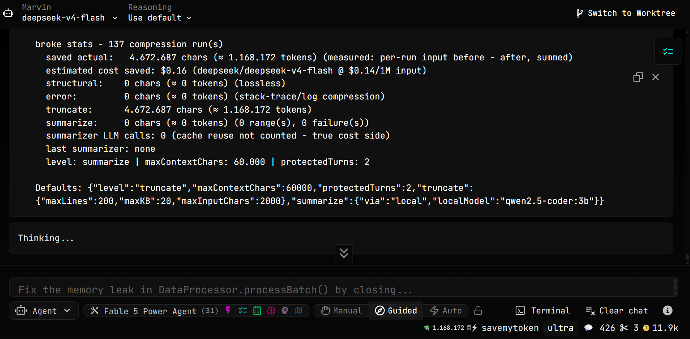
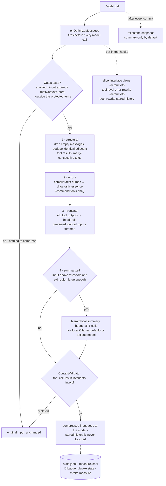

# broke

A token-budget extension for [AiderDesk](https://github.com/hotovo/aider-desk).
It shrinks the conversation **before every AI request**, so each request
costs less, and its strongest compression level can run on a **free local
model** instead of your paid one.

[](LICENSE)
[](https://github.com/777marvin/ext-broke/releases)
[](https://github.com/777marvin/ext-broke/actions)

<p align="center">
  
</p>

**Author:** [@777marvin](https://github.com/777marvin), this is my first
public repository. The extension is in active development, and feedback,
bug reports and feature ideas are very welcome (see [Status](#status)).

## Why I built this

Every AI request re-sends the whole conversation and bills every character
of it, again and again. Long agent sessions get expensive fast, and
AiderDesk only compacts the conversation in an emergency, using the same
(expensive) model you are already paying for.

broke flips that around: it compresses the input **before every single
request**, and its strongest level can do the summarizing **on your own
machine, for free** (via [Ollama](https://ollama.com)). Less sent = less
billed. That is the whole idea.

## What it does: in plain words

Think of broke as a cleanup crew for the text your AI is about to send.
Your stored chat history is never touched, only what gets *sent* to the
API is compressed:

| Level | What happens | Does anything get lost? |
|---|---|---|
| `structural` | removes empty messages, duplicates and repeated identical tool results | text content preserved; message framing may change (consecutive assistant texts merge into one) |
| `truncate` (default) | shrinks big compiler/test error logs to their essential lines, and cuts very old tool outputs down to start + end | only the middle of old outputs and error-log detail |
| `summarize` | replaces old parts of the conversation with one dense summary, generated by a free local model (Ollama, default) or a cheap cloud model | fine detail of old turns |

Your task description and your most recent messages are never touched.
broke only changes what gets *sent*, your stored conversation stays
exactly as it is.

## Does it actually save money?

Three honest tiers:

- **Guaranteed:** broke reduces the conversation payload delivered to the
  model - that is measured, per run, before vs. after.
- **Estimated:** the tokens (and dollars) broke displays are estimates via
  the `chars / 4` heuristic, not provider tokenizer counts.
- **Not guaranteed:** actual billing savings. They depend on system prompt,
  tool schemas, provider-side prompt caching, cache pricing and - at
  `summarize` level - the summarizer's own cost, which can offset part of
  the gross savings.

Beyond those tiers, the numbers broke itself shows are the ones your own
tasks produce: the 💸 badge and `/broke stats` measure every run with the
`chars / 4` heuristic and show them per pass, per task (the stats
headline is the measured before/after reduction).

Want provable real-session numbers instead of assertions? Turn on the
measurement ledger (`/broke measure on`, default) and broke appends one
record per real compression run to `measure.jsonl` (sizes and per-pass
removals only, no content, no paths; at 5 MB the file is rotated aside
and the previous generations are kept as `.1`/`.2`/`.3`). Then
`/broke measure` in a task - or `npm run measure` in the extension
directory - summarizes them: runs, tasks, per-run mean/median/max and
per-task breakdowns, explicitly labeled as a sum over individual runs,
not a cumulative context claim.

And for slice / flush / broke-search - features whose effect cannot be
measured like compression passes - there is `/broke estimate`. Flush shows
the measured net bytes freed per flush (`/broke flush --undo` takes them
back), slice reuses its existing per-read estimate, and broke-search shows
an explicitly counterfactual figure: what reading every result file whole
would have cost, minus what the snippets actually sent. None of these
figures enter the measured totals above - they answer a different,
rougher question.

For a reproducible reference there is a deterministic benchmark
(`npm run bench`): a 351,403-char synthetic session (67 messages, long
tool loops, a compiler-error dump, duplicated test runs) runs through the
real pipeline with the shipped defaults and a fixed stub summarizer. No
LLM, no randomness, byte-reproducible:

- shipped default level (`truncate`): **113,070 chars removed**
  (~28,268 tokens, 32.2% of the input);
- maximum level (`summarize`): **315,263 chars removed**
  (~78,816 tokens, 89.7% of the input; the old turns collapse into one
  ~400-char summary while the last 2 turns stay untouched).

The same benchmark also runs an **F4 keyword-index scenario** on a
deterministic fixture (in-memory index over a temp project). Its numbers
(`snippets sent` vs. `whole-file alternative`) document the counterfactual
model behind `/broke estimate`; they make no claim about real sessions.

**Honest caveats:** these are *synthetic* reference numbers, not a real
session, and the token conversion is the `chars / 4` estimate. The badge
shows *gross* input savings; the summarizer's own calls are listed
separately in `/broke stats`. Every cloud summarization costs one extra
request, and whether that request is worth it depends on four things at
once: how large the old region is, how many later calls re-send it, how
long the summary that replaces it turns out to be, and the price ratio
between the summarizer model and the task model. There is no fixed
character threshold to quote: with a cheap summarizer in a long session
the crossover sits low, with a frontier summarizer in a two-call task it
can be arbitrarily high. That is why the default is the free local one.
Details: [docs/overview.md](docs/overview.md).

## Install

**Easiest way: one command.** The official AiderDesk extension CLI
supports installing from any public GitHub repository:

```bash
npx @aiderdesk/extensions install -g https://github.com/777marvin/ext-broke
```

`-g` (global) installs into the shared extension directory,
`~/.aider-desk/extensions` (`%USERPROFILE%\.aider-desk\extensions` on
Windows). Without it the CLI installs into `.aider-desk/extensions` of the
**current working directory**, so the extension would end up in whatever
folder you happened to be standing in. It downloads the extension and
installs its dependency automatically.

**Manual install:**

```bash
git clone https://github.com/777marvin/ext-broke
cp -r ext-broke ~/.aider-desk/extensions/broke
cd ~/.aider-desk/extensions/broke && npm install   # zod
```

**Windows:** `~/.aider-desk` is `%USERPROFILE%\.aider-desk`. You can also
run `.\scripts\deploy.ps1 -Category extensions -Name broke -InstallDeps`
from inside the cloned repo, the script installs atomically and restores
the previous installation automatically if anything fails.

Extensions are hot-reloaded by AiderDesk: no restart needed.

**Updating an existing install:** ask broke itself - no script, no clone:

```
/broke update          # install the latest GitHub release
/broke update check    # only check whether a newer release exists
/broke update v0.8.0   # pin / roll back to an exact tagged version
```

Since 0.8.0, updates are cryptographically verified: the tagged release
ships a sha256sum manifest signed with Ed25519, and the updater checks
signature and checksum BEFORE anything is extracted or installed.
Unsigned or tampered releases are refused outright - which also means
releases older than 0.8.0 can no longer be (re-)installed this way;
roll back to the last signed version instead.

Runtime data lives OUTSIDE the swappable code tree, under a versioned
`<extension>/../.broke-data/v1/` root (`config.json`, `ledgers/`,
`snapshots/`, `index/`, `errors/`; `BROKE_DATA_DIR` overrides it) - a
one-time migration moves artifacts from earlier releases there on first
load. The update therefore carries no runtime state out of the
installation tree (there is nothing left to preserve) and rebuilds
dependencies with `npm ci` from the verified lockfile - `node_modules` is
never reused (BRK-009). It swaps the installation atomically: transient file
locks are retried, every payload file is verified after the copy before
the update declares success, and any failure rolls back to the previous
installation completely. Interrupted updates recover on the next run: a
transaction marker records the swap state, so the next `/broke update`
either discards a completed swap's leftover backup or restores the
previous installation from it - never a half-installed state.
Unlike a first install (hot-reloaded above), an update needs an AiderDesk
restart: the running instance keeps its previously loaded code until then.
`scripts/deploy.ps1` stays useful for first installs on a fresh machine and
for testing uncommitted changes during development; inside a git checkout
`/broke update` refuses to run by design.

**First five minutes:** open any task and check three things - the
**💸 badge** shows in the status bar, the **activation note** states the
active level and whether Ollama is reachable, and `/broke selftest` runs
the whole pipeline on synthetic input. That is the whole setup: broke is
active by default, every lever is documented under [Usage](#usage) and
[Tuning](#tuning-what-to-use-when).

## Requirements

- AiderDesk ≥ 0.84, Node.js ≥ 22. 0.84 is the floor because `/broke diff`
  reads the uncommitted changes through `TaskContext.getUpdatedFileDiff`,
  which the host added in 0.84; on an older host that one command reports
  what it needs and everything else in broke keeps working. From 0.80 on,
  broke also registers its config watcher via `context.addDisposable()`, so
  disabling or uninstalling the extension releases its directory handle
  automatically.
- Optional: [Ollama](https://ollama.com) running (`ollama pull
  qwen2.5-coder:3b`) for the free local summarizer. broke degrades
  gracefully when Ollama is offline: requests fail fast (at most 60 s per
  attempt, covering the full response, not just the connection), and after
  3 consecutive failures summarization auto-disables for that task.
- **Privacy:** a non-loopback `summarize.ollamaUrl` sends conversation
  content (including tool outputs) to that host. Such hosts are **blocked
  by default** - local summarization refuses to send anything until you
  explicitly consent with `/broke summarize allow-remote on` (or the
  settings-dialog toggle). When such a target is actually used, broke logs
  one clear `DISCLOSURE` warning naming it (review F-13) - remote
  summarization is treated as an explicit disclosure of best-effort
  masked conversation content, never as a secret-free guarantee. Plaintext
  `http://` remote URLs additionally
  trigger a warning; prefer `https://` or keep Ollama local.
  Common secret patterns are masked before the content is sent, but this
  is regex-based and best effort - unknown secret formats pass through
  untouched. Never point the summarizer at content you cannot afford to leak.

## Usage

Once installed, broke runs automatically. You will see:

- a **💸 badge** in the task status bar: estimated tokens saved for the
  current task (tooltip shows the breakdown per pass, and money saved at
  the current model's price). While a task has saved nothing yet, the badge
  shows why: `💸 0 · 31k/60k` means the conversation input is still below
  the threshold: an honest zero, not a malfunction, not a malfunction (`/broke why` gives the
  full gate-by-gate verdict);
- an **activation note** in every new task, showing the active config and
  whether Ollama is reachable;
- a **notice** when a compression run saves ≥ ~1000 tokens.

Scope note: broke measures and compresses only the **conversation messages**
it is handed before each model call. The system prompt, tool schemas and
provider-side prompt caching are outside its reach: a task can show 100k+
prompt tokens while broke correctly reports small or zero savings for it.

Everything can be controlled from the chat (`/broke help` lists all
commands) or from the gear icon on the extension card:

```
/broke                             status + stats + ollama status
/broke mode <short|normal|long|custom>
                                   task-length preset (extension-wide)
/broke autonomy <autonomous|manual>
                                   Broke automation only; manual = no automatic
                                   LLM summaries, tool rewrites or auto-snapshots
/broke on | off                    enable / disable
/broke level <structural|truncate|summarize>
/broke maxchars <n>                engage lossy passes above ~n chars
/broke protect <turns>             never compress the last n user turns
/broke truncate <lines> <kb>       old tool output limits
/broke errors on | off            compress compiler/test output (default: on)
/broke errors minchars <n>        compress matching outputs ≥ n chars (default 8000)
/broke errors lines <n>           context lines kept around the failure (default 8)
/broke errors toollevel <on|off>  rewrite stored history at tool level (default: off)
/broke errors archive <on|off>   save full outputs to errors/ (default: off)
/broke errors retention <days>   delete archived outputs older than n days (default 30)
/broke errors clear              delete the whole error archive now
/broke slice on | off            interface views for file reads (default: off)
/broke slice focus <path>        always return this file in full (per task)
/broke slice focus clear         drop the explicit focus
/broke slice status              slicing mode and current focus for this task
/broke index [rebuild]           build/rebuild the local project keyword index (persisted)
/broke index status              indexed files, terms, disk size, built age
/broke search <query>            broke-search snippet summary (top-k under char budget)
/broke search on | off           register / unregister the broke-search agent tool (default: on)
/broke snapshot [label]          record a milestone snapshot of this task now
/broke snapshot list             list this task's snapshots (newest first)
/broke snapshot show <n>         print snapshot #n
/broke flush [--yes]             DANGEROUS: replace everything after the task brief
                                 with one [broke-state] summary (asks by default)
/broke flush --undo <n>          restore the exact history stored with snapshot #n
/broke summarize via <local|cloud> summarizer backend
/broke summarize model <name>      Ollama model tag
/broke summarize cloud <provider/model>
/broke summarize after <turns>     compress only turns older than n
/broke summarize allow-remote <on|off>
                                   allow non-loopback Ollama hosts (default: off)
/broke summarize now               build + cache a summary of the old context NOW
                                   (manual pre-warm, applied on the next model call)
/broke stats                       per-pass saved chars/tokens
/broke diff [chars]                token-budgeted digest of the uncommitted changes
/broke estimate                    counterfactual view: slice / flush / broke-search
                                   (NOT part of the stats totals)
/broke why                         live gate-by-gate verdict: why 0 (or not)?
/broke measure                     summarize the per-run measurement ledger
/broke measure on | off            record every run to measure.jsonl (default: on)
/broke reset                       clear this task's stats
/broke selftest                    run the pipeline on synthetic input
/broke update                      self-update from GitHub releases
/broke update check                only check for a newer release
/broke update <vX.Y.Z>             pin / roll back to an exact version
/broke help                        all commands
```

## Tuning: what to use when

broke ships sane defaults, so most users never touch anything. When you do
want to tune, [docs/tuning.md](docs/tuning.md) maps every lever to the
situation it helps, states what each setting change actually buys you at
three task lengths, and has a playbook for autonomous agent runs.

The decision that matters most: pick the deepest level whose losses you
accept. The three levels are strictly additive (`truncate` includes
`structural`, `summarize` includes both), the content-preserving
`structural` pass runs on every call anyway, and every lossy pass only
engages above `maxContextChars` (default 60000 chars, about 15k tokens).
At the shipped default the reference benchmark removes ~32% of the input,
at `summarize` with the free local model ~90%.

## How it works

`onOptimizeMessages` fires before every model call. Four passes run over
everything older than the protected region (the task brief plus the last
`protectedTurns` user turns):

1. **structural**: drop empty messages, collapse identical adjacent tool
   results, merge consecutive assistant texts.
2. **errors**: compiler/test output is replaced by its diagnostic essence
   behind an explicit `… [broke: error summary - N lines → M lines]`
   marker.
3. **truncate**: old tool outputs cut to head+tail under combined hard
   limits (200 lines and 20 KB); oversized tool-call inputs become a short
   preview.
4. **summarize**: above the threshold and with a large enough old region,
   it is replaced by one cached `[broke-compacted]` summary.


```mermaid
flowchart TD
    A[Model call] --> B["onOptimizeMessages<br/>fires before every model call"]
    B --> G{"Gates pass?<br/>enabled · input exceeds maxContextChars<br/>· outside the protected turns"}
    G -- "no - nothing to compress" --> K["original input, unchanged"]
    G -- yes --> P1["1 · structural<br/>drop empty messages, dedupe identical adjacent<br/>tool results, merge consecutive texts"]
    P1 --> P2["2 · errors<br/>compiler/test dumps → diagnostic essence<br/>(command tools only)"]
    P2 --> P3["3 · truncate<br/>old tool outputs → head+tail,<br/>oversized tool-call inputs trimmed"]
    P3 --> Z{"4 · summarize?<br/>input above threshold and<br/>old region large enough"}
    Z -- no --> V
    Z -- yes --> SM["hierarchical summary, budget 8+1 calls<br/>via local Ollama (default) or a cloud model"]
    SM --> V
    V{"ContextValidator:<br/>tool-call/result invariants intact?"}
    V -- "violated" --> K
    V -- ok --> OUT["compressed input goes to the model -<br/>stored history is never touched"]
    OUT -.-> L[("stats.jsonl · measure.jsonl<br/>💸 badge · /broke stats · /broke measure")]

    B -. "opt-in tool hooks" .-> TH["slice: interface views (default off)<br/>tool-level error rewrite (default off)<br/>both rewrite stored history"]
    A -. "after every commit" .-> SN["milestone snapshot<br/>summary-only by default"]
```

Three guarantees hold on every run: images, file attachments and reasoning
parts are never silently dropped, a summary is never applied when it would
grow the context, and a `ContextValidator` reverts the whole compression
when the tool-call/result pairing invariants do not hold. After 3
consecutive summarize failures broke disables summarization for that task
and says why; the badge tooltip shows the state, and `/broke reset` or a
summarizer backend/model change re-enables it.

The per-pass rules, gates and failure handling are in
[docs/overview.md](docs/overview.md#how-the-pipeline-works).

## Feature deep dives

| Feature | What it does | Page |
|---|---|---|
| Cache-friendly mode | keeps already-sent bytes byte-stable so the provider prompt cache keeps hitting; one sanctioned full rewrite as escape hatch | [docs/features.md](docs/features.md#cache-friendly-mode-provider-prompt-cache) |
| ST-slicing | interface views instead of full file bodies for large reads (opt-in, and the rewrite is irreversible) | [docs/features.md](docs/features.md#st-slicing-tool-level-opt-in) |
| Snapshots & flush | milestone records per commit, plus the one destructive operation in broke (manual, confirmed, undoable) | [docs/features.md](docs/features.md#snapshots--flush-f3) |
| broke-search | offline keyword index serving budgeted `path:line` snippets to the agent | [docs/features.md](docs/features.md#local-project-search-broke-search-tool) |
| Security notes | prompt injection through summaries, what lands on disk, workspace confinement of the indexer | [docs/features.md](docs/features.md#security-notes) |

## Configuration

| Setting | Default | Description |
|---|---|---|
| enabled | on | Master switch |
| level | `truncate` | structural / truncate / summarize |
| mode | `custom` | task-length preset label (short / normal / long / custom); an edit to any preset-owned field flips it to `custom` |
| autonomy | `autonomous` | Broke automation only: `manual` suppresses automatic summarization, tool rewrites, auto-snapshots and index refreshes - explicit commands keep working |
| maxContextChars | 60000 | ≈15k tokens, engages lossy passes |
| protectedTurns | 2 | last N user turns never compressed |
| cache.profile | `off` | off / auto / anthropic / openai - keep the provider prompt cache hitting (see Cache-friendly mode) |
| cache.escapeHatch | on | one deliberate cache-invalidating rewrite on real budget overruns |
| cache.openaiStateless | off | the OpenAI provider runs stateless (Zero Data Retention, `store: false`) - switches OFF the OpenAI cached-input economics, which cannot apply to a request that stores nothing |
| truncate.maxLines / maxKB | 200 / 20 | old tool output limits |
| truncate.maxInputChars | 2000 | tool-call input trim threshold |
| errors.enabled | on | stack-trace/log compression |
| errors.minChars | 8000 | compress matching tool results ≥ N chars |
| errors.contextLines | 8 | context lines kept around the failure |
| errors.toolLevel | off | rewrite stored history at tool level |
| errors.archive | off | save full tool outputs to errors/ (on: explicit opt-in, capped + retention) |
| errors.retentionDays | 30 | delete archived outputs older than N days |
| slice.enabled | off | interface views for large file reads (ST-slicing) |
| slice.parser | `heuristic` | v1 heuristic only; `ast` reserved for web-tree-sitter |
| slice.minChars | 4000 | files smaller pass through untouched |
| slice.maxChars | 20000 | view cap; larger views fall back to full content |
| slice.focusAuto | on | derive focus from edit-tool calls / updated files |
| search.enabled | on | register the broke-search agent tool (offline keyword index) |
| search.backend | `keyword` | v1 ships keyword BM25 only; vector/hybrid reserved for v2 |
| search.maxResults / maxChars | 8 / 6000 | top-k results and TOTAL char budget per query (maxChars hard range 500-50,000; the footer counts toward the budget) |
| search.contextLines | 6 | context lines kept around each best match |
| search.maxFileKB | 512 | files larger than this never enter the index (hard ceiling 2048) |
| search.scanBudgetMs | 2000 | wall-clock budget for one index scan (100-60,000); hitting it marks the index `truncated`, which the search footer reports - raise it on a huge monorepo |
| summarize.via | `local` | local (Ollama) / cloud |
| summarize.localModel | `qwen2.5-coder:3b` | Ollama model tag |
| summarize.ollamaUrl | `http://127.0.0.1:11434` | Ollama base URL |
| summarize.allowRemoteHost | off | explicit consent for non-loopback Ollama hosts |
| summarize.cloudModelId | `` | `provider/model`; empty = task model |
| summarize.afterTurns | 8 | only summarize turns older than N (regions with zero user turns - autonomous single-prompt loops - are exempt) |
| summarize.minChars | 8000 | min region size for summarization |
| ui.showStatusBadge | on | 💸 badge in the task status bar |
| ui.showMessageMenu | off | a `broke: why` row in each user message's dropdown menu (AiderDesk 0.85+; the host mounts one instance per finished message, so this is opt-in) |
| stats.measure | on | one record per compression run in `measure.jsonl` |
| snapshot.onCommit | on | milestone snapshot after every successful commit |
| snapshot.onTestPass | off | test-green detection as milestones (heuristic misfires) |
| snapshot.keepHistory | off | raw-history undo files for auto/manual snapshots (privacy opt-in, F-01) |
| flush.confirm | on | ask before the destructive `/broke flush` |
| flush.undo | on | raw pre-flush undo file; enables `flush --undo` (abort-safe) |
| search.includeGitIgnored | off | opt-in: index git-ignored files too (dot-dirs and private-name denylists stay on regardless) |
| summarize.maxSummaryChars | 4000 | summary text entering the context is capped at this length |

Every setting above is reachable from the chat via
`/broke config list|get <path>|set <path> <value>` (schema-validated,
BRK-028) - no JSON hand-editing required. The gear dialog covers the
day-to-day surface (pipeline, errors, truncation, summarizer, search,
milestones/flush safety switches); anything not in the dialog is still
first-class through `config set`.

## Status

broke is in active development. The roadmap
([docs/feats.md](docs/feats.md)) documents the shipped features F1-F4 with
implementation specs; Feature 5 (mode presets short/normal/long/custom with
a Broke automation selector, reachable from the badge settings and the
settings panel) is part of the current release; it was introduced in
1.2.1 - see the exact preset table in docs/feats.md. Still on the
candidate backlog: an expanded live UI (estimated savings next to proven
ones, colored activity dot), minimalist operation and honest benchmarking -
all unscheduled.

broke targets AiderDesk's extension API. The compression logic itself is
plain TypeScript, so porting it to other agent platforms is possible in
principle, it is simply not planned right now.

## Documentation

- [docs/tuning.md](docs/tuning.md): which lever for which situation, per task length, plus the autonomous-run playbook
- [docs/features.md](docs/features.md): deep dives per feature (cache-friendly mode, ST-slicing, snapshots & flush, broke-search, security notes)
- [docs/overview.md](docs/overview.md): module map and pipeline internals
- [docs/token-saving.md](docs/token-saving.md): all levers that save tokens
- [docs/aiderdesk-builtin.md](docs/aiderdesk-builtin.md): what AiderDesk already saves on its own (verified from source)
- [docs/local-models.md](docs/local-models.md): what local models can really do on this hardware (RTX 3050, 4 GB VRAM)
- [docs/feats.md](docs/feats.md): feature specs and as-built record
- [docs/review-backlog.md](docs/review-backlog.md): the review ledger, a historical record of findings that are all closed

## Support, contributing and development

- Usage questions, misbehavior, bug reports: open an
  [issue](https://github.com/777marvin/ext-broke/issues). Attaching the
  output of `/broke why`, `/broke stats` or `/broke measure` speeds up
  diagnosis a lot - none of it contains conversation content. This is my
  first public repository, so bug reports and feature ideas are very
  welcome.
- Security issues: never in a public issue - follow
  [SECURITY.md](SECURITY.md) (private GitHub advisory).
- Contributing and local development: see
  [CONTRIBUTING.md](CONTRIBUTING.md), which also lists the `npm run`
  commands, the conventional-commit and changelog conventions, and how a
  release is cut and signed.

## License

[MIT](LICENSE), free to use, modify and distribute.
